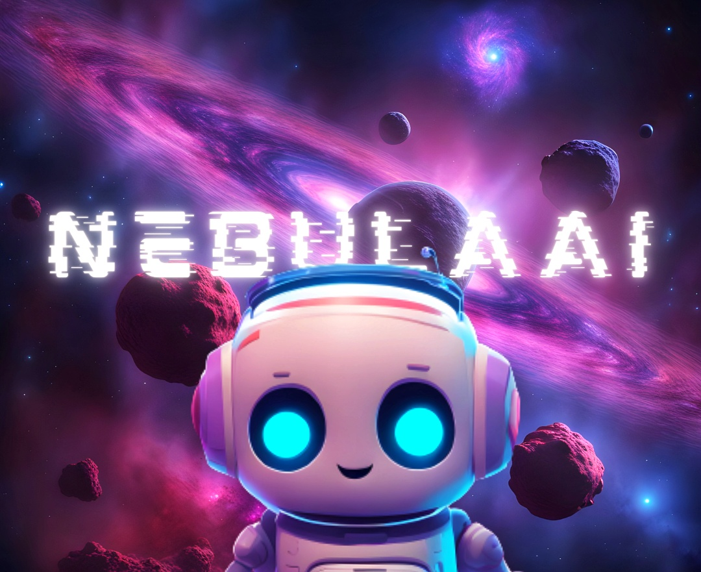
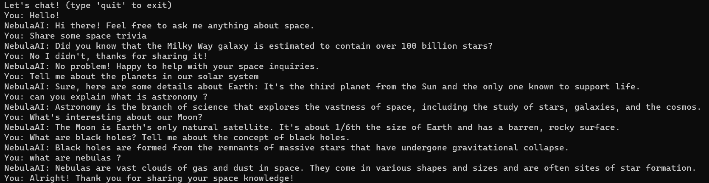

# NebulaAI Chatbot


Welcome to the NebulaAI Chatbot project! This chatbot is designed to provide information and answer questions related to space, astronomy, planets, black holes, nebulas, and more. It is built using Python and NLTK (Natural Language Toolkit) for natural language processing.

## Project Structure

The project consists of the following files:

1. **intents.json:** This file contains the intents and responses used by the NebulaAI chatbot. Each intent represents a specific topic or action.

2. **model.py:** The Python script for training and managing the NebulaAI chatbot model. It uses the intents.json file to create a model for responding to user queries.

3. **chat.py:** The main NebulaAI chatbot script that takes user input and interacts with the chatbot model to provide responses.

4. **nltk_utils.py:** Utility functions for text preprocessing and tokenization using NLTK.

5. **train.py:** A script to train the NebulaAI chatbot model using the data from intents.json.

## Usage

1. Clone this repository to your local machine.

2. Install the necessary libraries, including `torch`, `nltk`, and other dependencies, by running:

   ```bash
   pip install torch nltk

3. Run `train.py` to train the NebulaAI chatbot model using the data from intents.json.

4. After training, you can interact with the NebulaAI chatbot by running `chat.py`. Type your questions or statements, and the chatbot will respond based on the trained model.

## Example Usage

```
python chat.py
```

# Adding More Data
You can expand the NebulaAI chatbot's knowledge by modifying the intents.json file. Add more intents, patterns, and responses to cover a wide range of topics and questions.

# Image Output
Below is an example of the NebulaAI chatbot's output:


## License
This project is licensed under the [MIT License](LICENSE) - see the [LICENSE](LICENSE) file for details.

